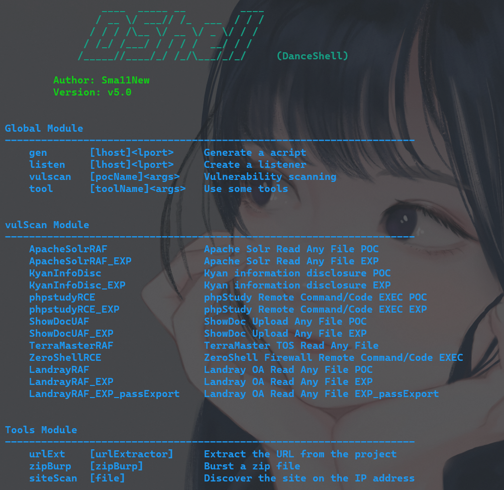
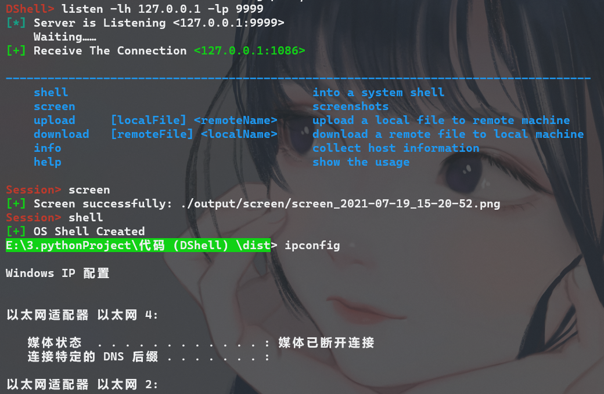

## DanceShell

Python编写的一款简单远控工具，附加漏扫和其他功能。目前为第5版，已经成功实现大部分功能，暂时停止后续更新。

#### 开发环境：

Python 3.7

Windows 10  + Ubuntu 18.4

#### 运行环境：

Python 3.7

Windows / Linux / Mac OS

#### 目录层级：

```
├─.idea
├─clientModule   客户端模块库
├─lib   重构库
├─misc  杂项代码及文件
├─serverModule   服务端模块库
├─tools   工具模块库
└─vulScan 漏扫模块库
  client.py   客户端文件
  client1.py  客户端脚本模板
  server.py   服务端主运行文件
```

## 使用示例

运行服务器文件server.py即可

```
python server.py
```

有4个关键字，分别是远控关键字gen、listen，漏扫关键字vulscan和工具关键字tool，使用相应关键字加-h即可查看用法，输入help可查看所有当前支持的模块。

如图示：



以远控为例，先使用gen生成木马，再使用listen关键字创建监听，运行木马文件即可建立远程控制连接



可执行命令、上传下载文件、信息探测、网络扫描等操作。